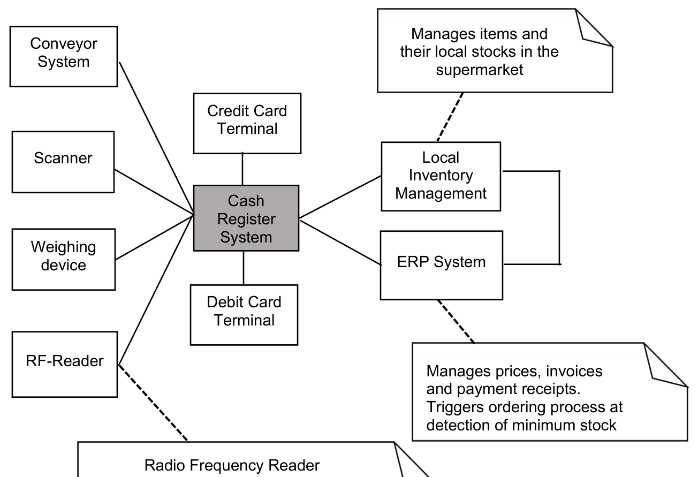

# SE Lab 2: Cash Register System

This repository contains the lab assignment for the Software Engineering course.

> [!TIP]
> Check out [this guide](https://guides.github.com/features/mastering-markdown/) about basic Markdown writing and formatting syntax. You can use [this online editor](https://dillinger.io/) to preview your Markdown files. If you are using VSCode, you can use the [Markdown Preview feature](https://code.visualstudio.com/docs/languages/markdown#_markdown-preview). Also, you might want to have a look at my [GitHub tutorial](https://github.com/sid115/GitHubTutorial).

## Directory Structure

The directory structure of this repository is as follows:

```plaintext
.
├── assets
├── vpp
├── .gitignore
├── DIRs.md
└── README.md
```

- `assets`: static files like images, diagrams, PDFs, etc.
- `vpp`: Visual Paradigm project files
- `.gitignore`: Git ignore file
- `DIRs.md`: Design Input Requirements table
- `README.md`: this file

## Task Definition

Your company is developing a modern cash register system to bill commissions in European supermarkets as well as smaller local selling shops. The company analyzed the state-of-the-art techniques, consulted prospective large customers (operators of supermarket chains) intensively, carried out surveys with typical customers of food markets, and conducted a weak point analysis in the currently deployed systems. Therefore, the company’s marketing division set the Design Input Requirements (DIRs) mentioned below.

The company management formed a project team (Core Team) and instructed it to develop a market-ready cash register system suitable for big supermarket chains as well as for individually hosted local shops for worldwide usage within one year. The project leader R&D Software is the responsible core team member for software development. The development team is staffed by up to 8 software developers including yourself.

Prior to releasing any further development funds, the company management instructed you to create a system prototype and derive an efficient software architecture throughout an integrated concept and feasibility phase.

According to the company’s software and system development guidelines, the following deliverables must be generated and reviewed before releasing AFD (Approval For Development) and entering subsequent development phase:

1. **Revised and completed respectively corrected DIRs**, in case you detect significant gaps or inconsistencies in the DIR document.
2. **Sound verification methods per DIR**, which allows you to prove that the final (software) product meets the specific requirement. This is only needed if the documented verification method doesn’t fit or a verification method is not already documented within the DIR.
3. **Documented Context Model**, i.e. model drawing and explanation/reasoning.
4. **Documented Use Case Model**, i.e. model drawing including meaningful naming of Use Cases and structured descriptions of Use Cases.
5. **Documented Activity Models**, i.e. model drawings linking to corresponding Use Cases, defining trigger conditions, and including meaningful naming of Activities and eventually Actions.
6. **Documented Entity Model**, especially including attribute types and ranges of values as well as methods’ signatures.
7. **Documented State Diagrams** of entities, as needed.
8. **Sound concept of the software architecture**.

According to the development guidelines, the deliverables of the development phase are:

9. Detailed software specifications, as needed.
10. C++ source code.
11. Module tests (conducted by developer).
12. System integration test(s).

Use Visual Paradigm for UML modeling. Use Visual Studio for C++ programming, if compatible with project deadlines. The deliverables 1-8 must be worked out and documented completely during the lab. The deliverables 9-12 shall be achieved to the greatest extent possible.

---

## System Overview

The results from previous analyses and surveys determine the following context diagram as the most likely full-complexity-scenario in a modern supermarket, that could be scaled down for less complex situations. Not every supermarket is equipped with all the external systems shown in the diagram. Furthermore, it is assumed that there isn’t always an online connection between the cash register system and the ERP System (Enterprise Resource Planning) or the local inventory management. Therefore, the cash register system must be capable of working locally isolated for the complete offline time period.

Take into consideration that a modern company probably has lots of supermarkets distributed worldwide over their region of interest and each supermarket may have several cash register systems, which could be operating at the same time.

- Conveyor System
- Scanner
- Weighing device
- RF-Reader
- Cash Register System
- Credit Card Terminal
- Debit Card Terminal
- Local Inventory Management
- ERP System


